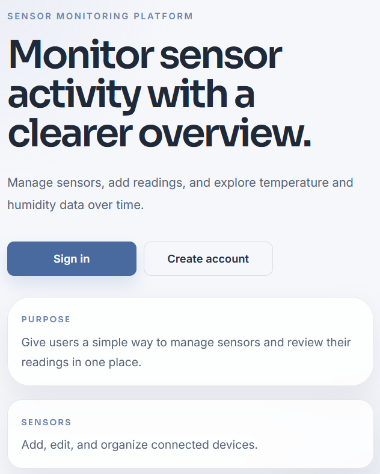
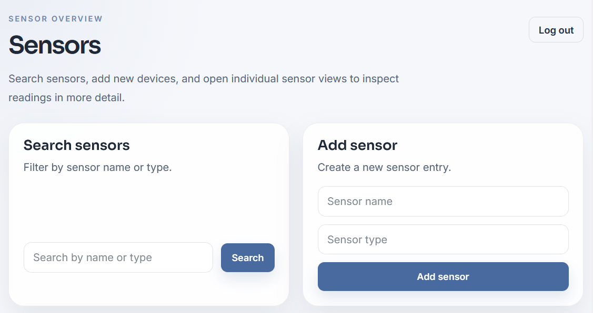
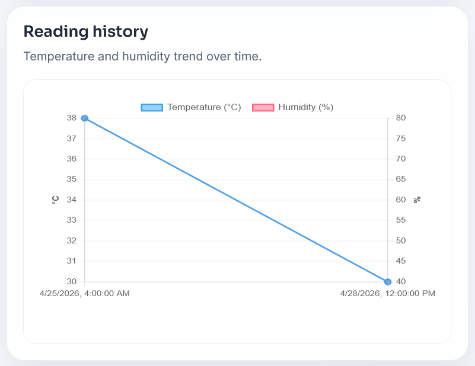

# Sensor Monitoring Platform

A fullstack web application for managing sensors and their readings, with filtering, chart-based visualization, and responsive views for mobile, tablet, and desktop.

---

## Features

- Token-based authentication
- User registration and sign in
- Protected API endpoints
- Create, edit, and delete sensors
- Search sensors by name or type
- Sensor overview with pagination
- Sensor details with chart-based reading history
- Filter readings by date and time range
- Add new temperature and humidity readings
- Responsive UI optimized for mobile, tablet, and desktop
- Inline messages, modals, toast feedback, and custom confirmation flows

---

## Tech Stack

### Backend

- Django 5
- Django Ninja
- Django REST Framework Token Authentication

### Database

- PostgreSQL (Dockerized)

### Frontend

- Vanilla HTML
- Vanilla CSS
- Vanilla JavaScript
- Chart.js

### Testing

- pytest

---

## Project Structure

    backend/               # Django configuration
    core/                  # Main Django app (models, schemas, API, auth, admin)
    frontend/              # Static HTML, CSS, and JavaScript
    sensor_readings_wide.csv
    docker-compose.yml
    Makefile
    README.md

---

## Setup

### 1. Environment

Create a `.env` file in the root directory:

    DJANGO_SECRET_KEY="change-me"
    DJANGO_DEBUG=True
    DJANGO_ALLOWED_HOSTS=localhost,127.0.0.1

    POSTGRES_DB=sensordb
    POSTGRES_USER=sensoruser
    POSTGRES_PASSWORD=sensorpass
    POSTGRES_HOST=db
    POSTGRES_PORT=5432

---

### 2. Run locally

    # Optional cleanup
    docker compose down -v

    # Build and start containers
    make up

    # Apply migrations
    make migrate

    # Load demo data
    make seed

---

### 3. Start the frontend

    cd frontend
    python -m http.server 5500

Then open:
http://127.0.0.1:5500/index.html

From the start page, you can create an account or sign in.
After signing in, you can manage sensors and open individual sensor views to inspect readings in more detail.

---

## API Overview

### Authentication

    POST /api/auth/register
    POST /api/auth/token

Both endpoints return a token used for all protected requests:

    Authorization: Bearer <token>

### Sensors

    GET    /api/sensors
    POST   /api/sensors
    GET    /api/sensors/{id}
    PUT    /api/sensors/{id}
    DELETE /api/sensors/{id}

Query parameters:

- `q` → search by name or type
- `page` → specify which page to load

### Readings

    GET  /api/sensors/{sensor_id}/readings
    POST /api/sensors/{sensor_id}/readings

Query parameters:

- `timestamp_from`
- `timestamp_to`

---

## Run Tests

    make test
    # or:
    docker compose exec web pytest -q

Includes tests for:

- Authentication
- Protected endpoints
- Sensor creation
- Reading creation
- Reading filtering and ordering

---

## Purpose

I built this project to practice how a fullstack application works end to end, from authentication and API design in the backend to presenting structured sensor data in the frontend.

I also wanted to work with data that could be filtered, listed, and visualized in a way that feels clear and useful.

---

## What I Learned

- How to structure API routes with Django Ninja
- How token-based authentication works in practice
- How to model relational data for sensors and readings
- How to filter and return data based on ownership and date range
- How to connect a vanilla JavaScript frontend to a Django backend
- How to present readings with charts, filters, and responsive layouts
- How to improve UX by replacing browser popups with modals, inline messages, and toast feedback

---

## Screenshots

### Sensor Monitoring Platform

### Sensor Overview

### Sensor Details

---

## Author

Jennifer – Junior Fullstack Developer
